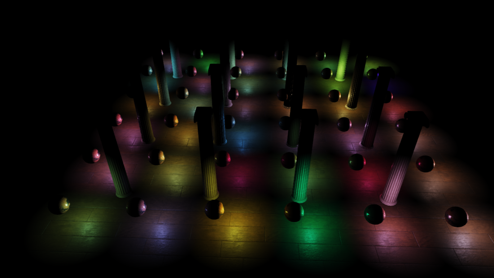
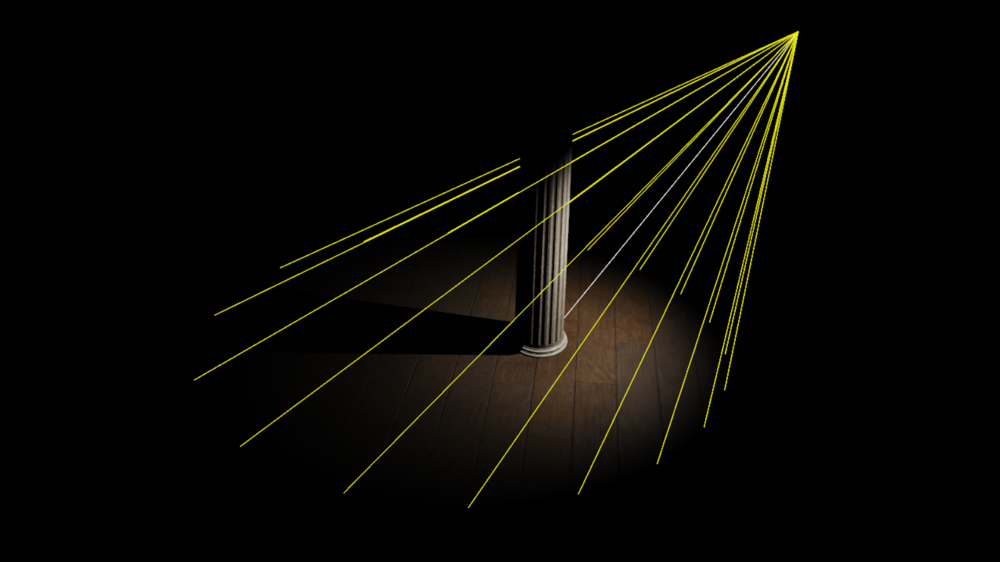
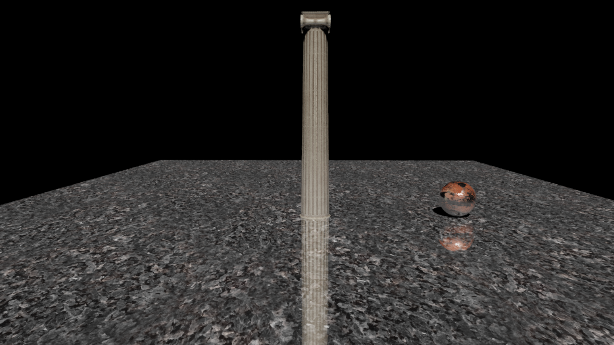
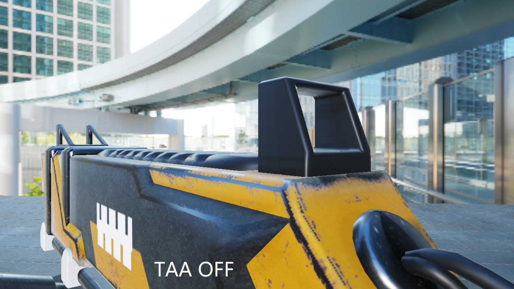

# TotoroEngine
TotoroEngine is a toy 3D game engine using DirectX 12.

# Prerequisites
1. Only support Windows(Only test on Windows 10).
2. If you have not install "Graphics Tools", please install it to enable DirectX debug layers, see https://stackoverflow.com/questions/60157794/dx12-d3d12getdebuginterface-app-requested-interface-depends-on-sdk-component
   Or you can set the "InstalledDebugLayers" macro in D3D12RHI.cpp to false. 

# Build and Run
1. Download FBX SDK VS2019: https://www.autodesk.com/developer-network/platform-technologies/fbx-sdk-2020-2
2. Install FBX SDK, then copy "include" and "lib" folders to TotoroEngine\Engine\ThirdParty\FBX_SDK\
3. Open TotoroEngine.sln with Visual Studio 2019.
4. Choose a sample project (such as "Sample-PBR"), set it as startup project, build project.
5. Copy the libfbxsdk.dll (from TotoroEngine\Engine\ThirdParty\FBX_SDK\lib\vs2019\x64\debug) to the debug folder of sample project (such as TotoroEngine\Samples\Sample-PBR\Binaries\x64\Debug).
6. Run.

# Features
## Basis
* D3D12 Memory Allocation
* D3D12 Descriptor Management
* D3D12 Resource Binding

## Rendering
* PBR (Physically Based Rendering)
  
  
  
  
  
  
  
  
* TBDR (Tile-Based Deferred Rendering)
  
  
  
  
* Light
  * DirectionalLight
  * PointLight
  
  
  
  * SpotLight
   
  
  
  * AreaLight(LTC)
  
  
  
  
* PCSS (Percentage-Closer Soft Shadows)
  
  
  
  
* VSM (Variance Shadow Mapping)
  
  
  
  
* SDF
  
  
  
  
* SDF soft shadow
  
  
  
  
* SSAO (Screen Space Ambient Occlusion)
  
  
  
  
  
  
* SSR (Screen Space Reflection)
  
  
  
  
* TAA (Temporal Anti-Aliasing)
  
  
  
  
* PostProcess
  * ToneMapping
  
# Document
https://www.zhihu.com/column/c_1434895110592552960 (Chinese)
  